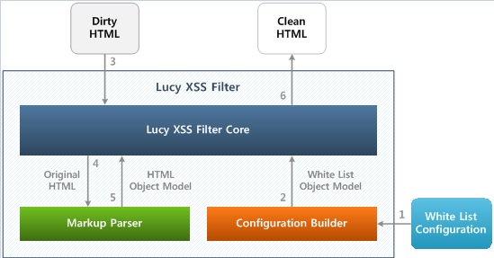

= 내부 구조

Lucy-XSS Filter는 다음과 같은 요소로 구성된다

* Lucy-XSS Filter Core  : Markup Parser를 통해 파싱한 HTML 문자열을 White List Object Model과 비교하여 필터링한 결과(Clean HTML)를 반환한다.
* Markup Parser :  문자열을 파싱하여 HTML Object Model로 변환한다. DOM(MarkupParser.java)과 SAX(MarkupSaxParser.java) 두 가지 방식이 존재한다.
* Configuration Builder : White List Configuration에 정의된 내용을 바탕으로 White List Object Model을 생성한다.
* White List Configuration : 정상적인 HTML 구조를 화이트리스트 방식으로 정의한 설정 파일로서, XML 형식으로 되어 있다.

Lucy-XSS Filter 객체를 생성하면 Configuration Builder는 White List Configuration에 정의된 내용을 바탕으로
White List Object Model을 생성하여 Lucy-XSS Filter Core로 전달한다.
Lucy-XSS Filter Core는 Markup Parser(DOM, SAX 둘 다 지원 )가 필터링 대상 HTML 문자열을 파싱하여 생성한 HTML Object Model을
White List Object Model과 비교하여 필터링한다.
