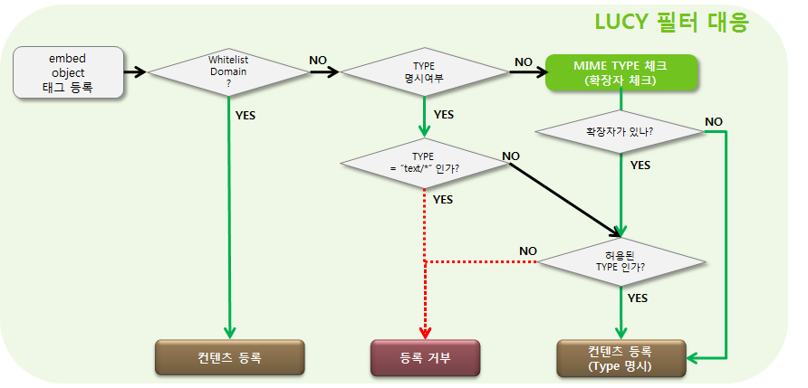

= Listener

확장 지점으로 `ElementListener` 와 `AttributeListener` 를 제공한다.

XssSaxFilter를 쓸 때에는 아래와 같은 제약이 있다.

* Element의 자식을 추가, 삭제, 수정하는 작업을 Listener에서 할 수 없다
** ContentsRemoveListener, ObjectListener 사용 불가(ParamListener로 대체)).
* IEHack의 관련한 스펙
** "IEHack의 startTag만 있고, endTag는 없는 경우나, 또는 endTag가 깨broken인 경우 IEHack 자체(startTag)를 제거" 스펙을 지원하지 않음.

== ElementListener
`com.nhncorp.lucy.security.xss.event.ElementListener` 를 활용하면 특정 요소에 하위 요소를 추가하거나 데이터를 변경할수 있다.

예를 들어, `<embed/>` 태그에 `autostart='falase'` 선언과 `<param>` 요소를 내부에 추가하는 로직을 구현한다고 가정한다.
다음과 같이 `ElementListener` 인터페이스를 구현하는 클래스를 작성한다.

[source,java]
----
public class EmbedListener implements ElementListener {
    public void handleElement(Element elem) {
        // autostart="false" 추가
        elem.putAttribute("autostart", "\"false\"");

        // <param> 요소 추가
        elem.addContent(new Element("param"));
    }
}
----

구현한 클래스는 다음과 같이 XML 파일 안에서 지정한다.

[source,xml]
----
<element name="embed">
    <!-- ElementListener 인터페이스를 구현한 클래스 이름을 기술한다. -->
    <listener>com.nhncorp.lucy.security.xss.test.EmbedListener</listener>
</element>
----

=== ElementListener 기본 구현체
Lucy-XSS Filter에서는 `<embed/>` 와 `<object/>` 요소의 취약점에 대응할 수 있는 `ElementListener` 구현체를 제공한다.
기본 구현체에는 Flash, Media Player 관련 보안 대응과 소스의 MIME 타입을 확인해서 html일 경우 이스케이프 처리하는 로직이 존재한다.

추가로 허용하는 도메인인지 확인하기 위해 `white-url.xml` 에 기술되지 않은 리소스(URL)일 경우 `type` 속성을 확인하고 허용되지 않은 type(예를 들어 text/html)일 경우 이스케이프 처리한다.
Type 속성이 명시되어 있지 않을 경우 리소스의 확장자를 기반으로 이를 유추하고 type 속성을 추가해 준다.
검사하는 MIME 타입은 Apache Httpd에서 지원하는 MIME 타입을 바탕으로 만들어져 있으며 “text/*” 타입만을 제거하였다.
Type 속성과 리소스의 확장자 모두 존재하지 않는 경우는 서비스의 가용성을 위해 이스케이프 하지 않는다.
Xss filter에서는 허용할 MIME 타입을 추가할 수 있는 확장 지점을 제공한다.

* 확장포인트(프로퍼티파일 추가) 사용방법
** 프로젝트의 클래스패스에 `xssfilter-extension.properties` 파일생성
** 확장자=MIME TYPE 형식으로 허용 할 확장자와 확장자에 해당하는 MIME TYPE 추가

예를 들어, 기본 정책으로는 막혀있는 확장자인 html을 허용하고자 한다면 아래와 같이 설정하면 된다.

[source]
.xssfilter-extension.properties 파일
----
html=text/html
----

WARNING: 프로퍼티 파일 이름이 위와 다르거나 MIME 타입 선언이 빠지면 해당 기능이 동작하지 않는다.

.ObjectListener/EmbedListener/ParamListener 필터링 규칙
[options="header", cols="20,80"]
|=========================================================
|항목 |필터링 규칙
|ObjectListener

(DOM 방식에서만 지원)
a|아래와 같이 파라미터를 변경하거나, 없는 경우 추가한다.

[source,xml]
----
<param name="allowScriptAccess" value="never" />
<param name="autostart" value="false" />
<param name="invokeURLs" value="false" />
<param name="autoplay" value="false" />
<param name="enablehref" value="false" />
<param name="enablejavascript" value="false" />
<param name="nojava" value="true" />
<param name="AllowHtmlPopupwindow" value="false">
<param name="enableHtmlAccess" value="false">
<param name="allowNetworking" value="internal">
----

`white-url.xml` 에 기술된 리소스일 경우 'allowNetworking'을 "all"로, 기술되지 않은 리소스일 경우 "internal"로 변경한다.

|EmbedListener
a|'invokeURLs', 'autostart' 값을 "false"로, 'allowScriptAccess' 값을 "never"로 변경한다.

white-url.xml에 기술된 리소스일 경우 'allowNetworking'을 "all"로, 기술되지 않은 리소스일 경우 "internal"로 변경한다

|ParamListener
(SAX 방식에서만 지원)
a|아래와 같이 각 파라미터의 value를 지정된 값으로 변경한다.

[source,xml]
----
<param name="allowScriptAccess" value="never" />
<param name="autostart" value="false" />
<param name="invokeURLs" value="false" />
<param name="autoplay" value="false" />
<param name="enablehref" value="false" />
<param name="enablejavascript" value="false" />
<param name="nojava" value="true" />
<param name="AllowHtmlPopupwindow" value="false">
<param name="enableHtmlAccess" value="false">
----
param의 부모 태그인 object에 대한 처리는 XssSaxFilter 자체적인 로직에서 처리한다.
결국 SAX 방식에서도 param 태그에 대해 ParamListener를 사용하면, 기존 ObjectListener와 동일한 효과가 있다.

|=========================================================

`Object`, `Embed` 태그는 디폴트로 제공되는 `lucy-xss-superset.xml` 설정 파일에는 disable 처리가 되어 있다.
서비스에 따라서는 이 태그들을 사용할 필요가 있는데, 이럴 경우 보안설정이 추가된 `ObjectListener` / `EmbedListener` / `ParamListener` 를 사용해서 XSS 공격을 방어해야 한다.
그렇게 사용할 경우에는 `lucy-xss-superset.xml` 을 상속하여, 아래와 같이 설정 파일에 기술한다.

[source,xml]
----
<elementRule>
    <element name="embed" disable="false">
        <listener>com.nhncorp.lucy.security.xss.listener.EmbedListener</listener>
    </element>
    <element name="object" disable="false">
        <listener>com.nhncorp.lucy.security.xss.listener.ObjectListener</listener>
    </element>
</elementRule>

----

XssSaxFilter를 사용하는 경우 `lucy-xss-superset-sax.xml` 을 상속하여, 아래와 같이 설정 파일에 기술한다.

[source,xml]
----

...
<elementRule>
    <element name="embed" disable="false">
        <listener>com.nhncorp.lucy.security.xss.listener.EmbedListener</listener>
    </element>
    <element name="object" disable="false"></element>
    <element name="param" disable="false">
        <listener>com.nhncorp.lucy.security.xss.listener.ParamListener</listener>
    </element>
</elementRule>
...
----

`ObjectListener` 와 `EmbedListener` , `ParamListener` 는 `white-url.xml` 에 설정된 내용을 바탕으로 필터링을 수행한다.
`white-url.xml`은 클래스패스의 최상위 경로에 존재해야 한다.
이 파일이 해당 경로에 없으면 모든 URL 리소스가 필터링 대상이 되므로, 반드시 파일을 작성해야 한다.

[source,xml]
.white-url.xml 예시
----
<?xml version="1.0" encoding="UTF-8"?>
<white-url>
    <domain name="http://www.naver.com" desc="네이버">
        <pattern>http://serviceapi.nmv.naver.com/*</pattern>
        <pattern>http://scrap.ad.naver.com/*</pattern>
    </domain>
    <domain name="http://www.daum.net" desc="다음">
        <pattern>http://flvs.daum.net/flvPlayer.swf*</pattern>
    </domain>

    ...
</white-url>
----

== AttributeListener
`com.nhncorp.lucy.security.xss.event.AttributeListener` 를 활용하면 모든 요소들의 특정 속성에 추가적인 작업을 수행할 수 있다.

예를 들어, `src` 속성을 가지는 모든 요소들에 대해 허락되지 않은 URL은 빈 문자열로 치환하는 처리를 한다고 가정한다.
아래와 같이 `AttributeListener` 를 구현한 `SrcAttributeListener` 를 작성한다.

[source,java]
----
WhiteUrlList list = WhiteUrlList.getInstance();

public void handleAttribute(Attribute attr) {
    if (!list.contains(attr.getValue())) {
        attr.setValue("\"\"");
    }
}
----

다음과 같이 XML 설정으로 `SrcAttributeListener` 를 추가한다.

[source,xml]
----
<attributeRule>
    <attribute name="src">
        <listener>com.nhncorp.lucy.security.xss.listener.SrcAttributeListener</listener>
    </attribute>
</attributeRule>
----